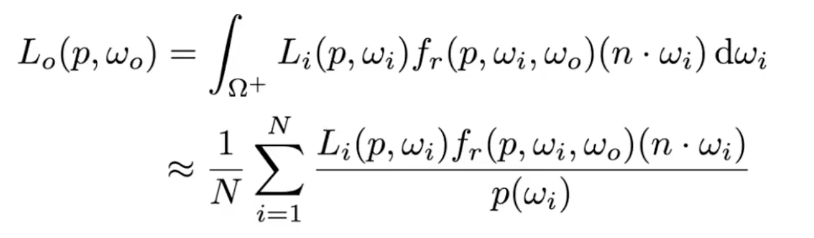

<!-- more -->

## Monte Carlo Integration

蒙特卡洛积分

一种基于概率的模拟算法

$$\int_a^bf(x)dx = \frac{1}{N}\sum_{i=1}^N\frac{f(X_i)}{pdf(X_i)}$$

使用蒙特卡洛积分解渲染方程

## Path Tracing

对于路径追踪的简单总结

- 从相机出发，逐像素打出光线(一个像素有多条)
- 光线接触到物体表面，使用渲染方程，计算出物体的 Radiance
- Radiance 分为两个部分，一个是对半球积分，一个是对光源积分
- 通过蒙特卡洛解积分的反射光线只需要一根(限制指数级膨胀)，且需要使用 Russian Roulette 来计算概率

## 总结

路径追踪，基于物理的渲染模型，需要许多额外的知识储备  
如高数，概率论等，和基础的辐射度量学（物理）  
至此，我只是弄明白了路径追踪的思路  
但是并没有完全弄清楚辐射度量学部分  
不过也还好，起码现在能看懂PRB的相关文章了  

后续打算学习高数，线代，概率论后，再回头来补充吧
