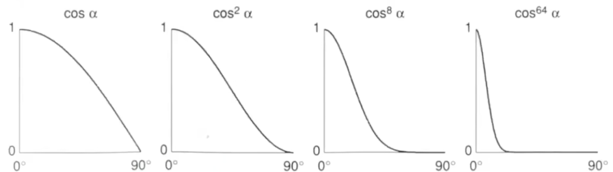

<!-- more -->

$\hat{l}$ : 物体到光的方向  
$\hat{n}$ : 物体表面的法线  
$\hat{v}$ : 物体到眼睛方向  
$I$ : 光源强度  
$r$ : 光源到物体的距离  

 

## Specular Highlight (高光)

$K_s$ : 镜面反射颜色  
$p$ : 高光指数(shininess)

### Phong Reflection Model

计算高光，直觉上来讲，是光源反射方向（光源入射方向经过镜面反射后的方向）与视线方向的相近程度决定的

图中的 $R$ 即为 光源镜面反射后的方向

$$
specular = K_s(I/r^2)max(0,\hat{R}·\hat{v})^p
$$

### Blinn–Phong Reflection Model

但是在Blinn-Phong模型中，我们使用Half Vector(半程向量)来计算高光

$$
h_{half-vector} = \frac{\hat{l} + \hat{v}}{|\hat{l} + \hat{v}|}
$$

进而我们只需要关心$h$与$n$的相近程度即可得到高光

$$
specular = K_s(I/r^2)max(0,\hat{n}·\hat{h})^p
$$

### 关于指数p

从上图中可以看出，高光程度，在没有指数的情况下，衰减速度非常的慢，这会导致高光的范围较大  
指数的引入，可以快速地衰减高光范围

### 区别 
值得注意的是，在 Blinn-Phong reflection model 的 wiki 中提到：   
Phong reflection model 的 $p$ = shininess / 4.0  
Blinn-Phong reflection model 的 $p$ = shininess  

Blinn-Phong 的 半程向量 相比于 Phong 的 镜面反射向量 要好算得多

## Diffuse Reflection (漫反射)

$K_d$ : 漫反射颜色  

$$
lambertian_{diffuse} = K_d(I/r^2)max(0,\hat{n}·\hat{l})
$$

这个公式又被称为 lambertian reflectance  

## Ambient Lighting (环境光)

$K_a$ : 环境光颜色  
$I_a$ : 环境光强度

环境光在现实世界中，是非常复杂的  
在 Blinn-Phong 模型中，环境光被假定为是任意处的环境光强度都是一样的
$$
ambient = K_aI_a
$$