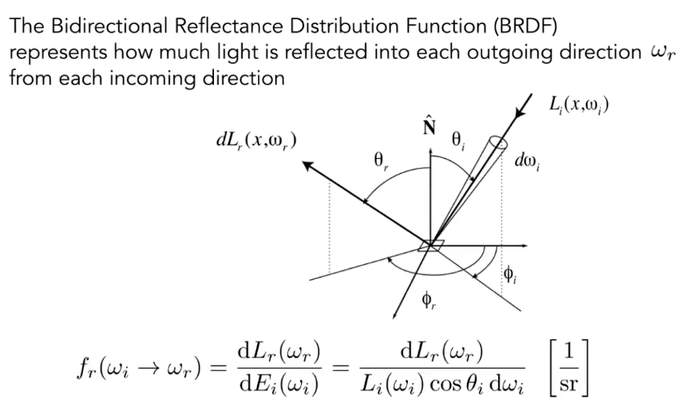

<!-- more -->

## 警告
通篇胡说八道，并不太理解

## 双向反射分布函数

Birdirectional Reflectance Distribution Function

## 描述

Reflection at a point

- 该函数描述如下过程  
一个极小面积($dA$)  
从某一个极小立体角($d\Omega$)  
接受到的Irradiance($dE$)  
会如何分配到该$dA$的各个立体角上的过程

- 进一步描述  
对于任意出射方向计算出Radiance($dL$)  
除以一个极小面积($dA$)接收到的Irradiance($dE$)  

