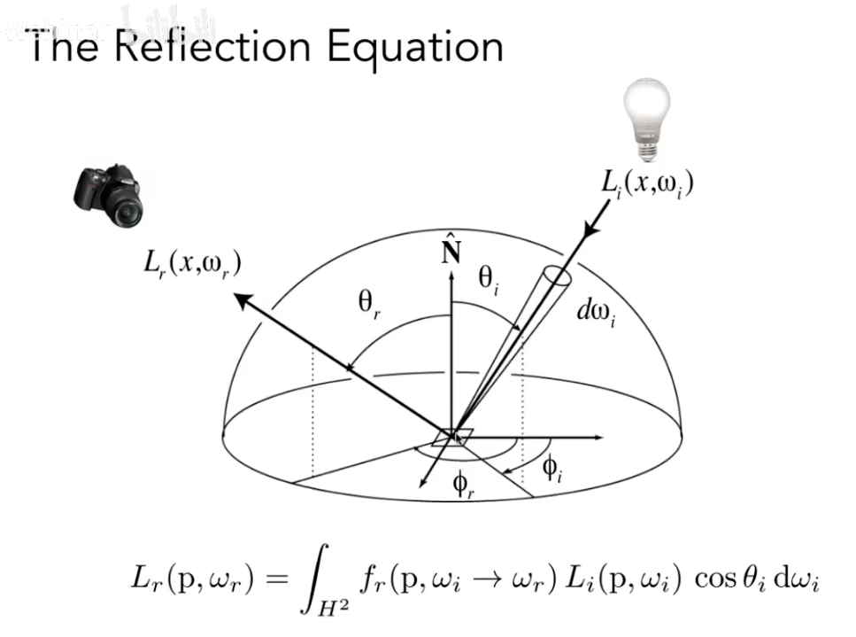
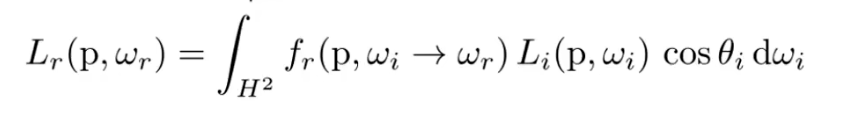
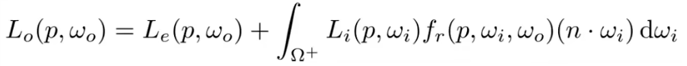

<!-- more -->

## 双向反射分布函数

Birdirectional Reflectance Distribution Function

## 描述

Reflection at a point

- 该函数描述如下过程  
一个极小面积($dA$)  
从某一个极小立体角($d\Omega$)  
接受到的Irradiance($dE$)  
会如何分配到该$dA$的各个立体角上的过程

- 进一步描述  
对于任意出射方向计算出Radiance($dL$)  
除以一个极小面积($dA$)接收到的Irradiance($dE$)  

## 总结

### 我们是如何看见物体的？

对于一个点来说，我们是如何看到物体的  
首先是计算该点从所有方向上接收到光的辐射能量  
在这一过程中，会消耗(吸收)一部分的能量  
$^{[1]}$而剩余的能量会再次向四面八方辐射出去  
其中一部分能量会进入我们的眼睛，即物体被我们看到

### BRDF做了什么？

BRDF反射函数，定义了上述过程中$^{[1]}$这个步骤里  
该点(物体)如何向外辐射(反射)能量

举例：漫反射，即能量是均匀的向所有方向发散的

### 为什么需要 Radiometry ？

Radiometry定义了光的各种属性，将光这一概念参数化，数据化，从而进行模拟计算  
使我们能够构建基于物理的光照模型

### 我懂了吗？

微积分在大致概念上，可以理解  
但是推导的细节，并不能完全理解

## BRDF 实现困难的地方

对于一个点而言，计算所有方向来的光的Radiance，其实是一个很困难的事情  
因为该点收到的光，可能是从别的物体辐射而来的光  
所以这就涉及到了设定光的反射次数  
假设光的反射次数是1的话，那该点所能接收到的光就只剩下光源了  

## The Rendering Equation

而渲染方程，需要考虑子放光Emission，加上去即可

