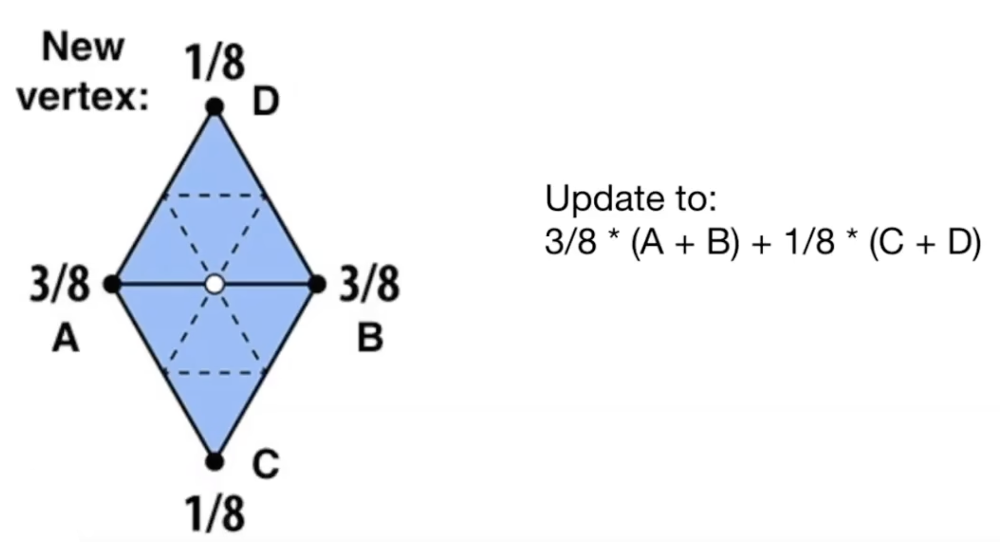
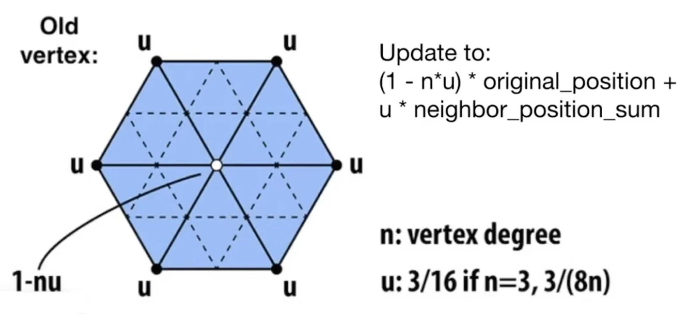
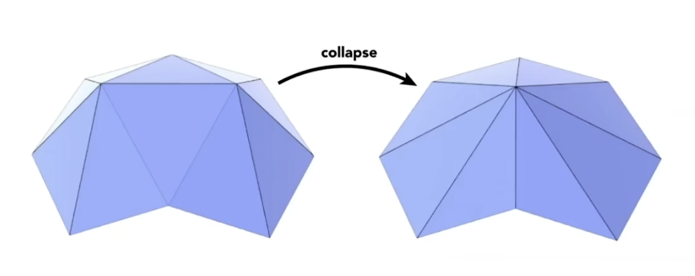
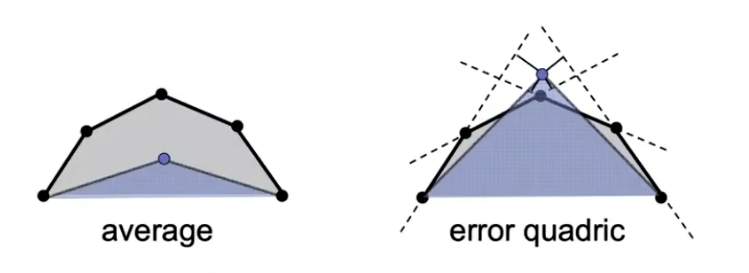

<!-- more -->

## 隐式几何

### 特点

- 优点，容易证明给定点是否在表面上
- 缺点，难以找出在表面上的点

差不多是定义了

### 例子
- 球的隐式表示$x^2+y^2+z^2=1$ 
- Constructive Solid Geometry（CSG 构造实体几何）
	- 使用多个简单的隐式几何，进行bool 操作
	- 并，交，差 
	- *Blender 中有
- Distance Functions 距离场
- Signed Distance Functions 有向距离场
- Fractals 分型几何

## 显式几何

### 特点

- 优点，通过遍历uv即可获得所有点的信息
- 缺点，难以证明一个点是否在表面
  
与隐式几何相反

### 例子

- 建模，即是一种显式几何(确定的表示出了所有点的位置)
- Point Cloud 点云
- Polygon Mesh 多边形网格
- Bezier Curves 贝塞尔曲线

## Subdivision 细分

举例一种简单的细分算法

- Loop Subdivision
- 1，增加三角形，在原三角形三条边取中点，连线，构建4个新的三角形
- 2，更新顶点位置，下图举例

## Mesh Simplification 简化

简单举例一种简单的简化算法

- Edge Collapse 边坍缩

- Quadric Error Metric 二次误差度量（实现细节略）

- 取二次度量误差最小的边，进行坍缩，而后更新所有影响的边，重复操作

## 总结

Geometry 章节让人看到了 图形学的多样性，而非仅仅只是Shading部分  
这一部分笔记并不多，只记录了简单的关键词，兴许日后碰到了，好有些查阅资料的依据