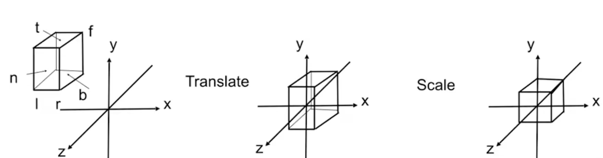
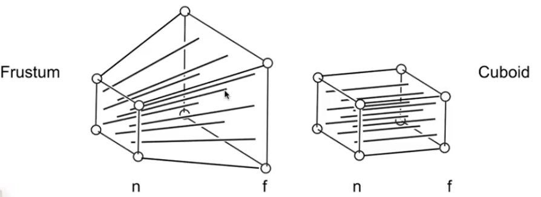
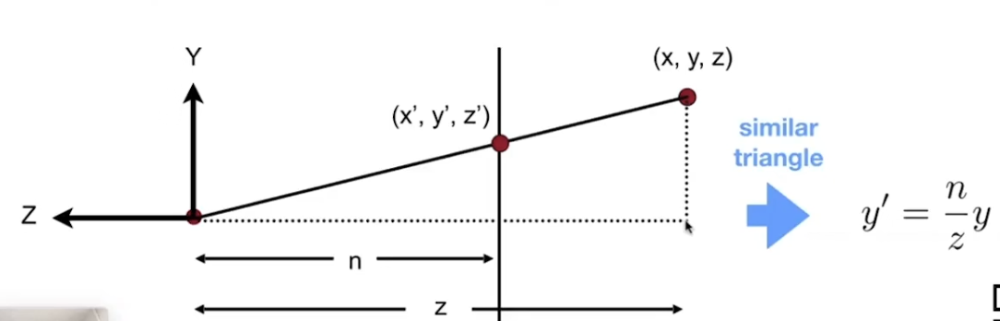
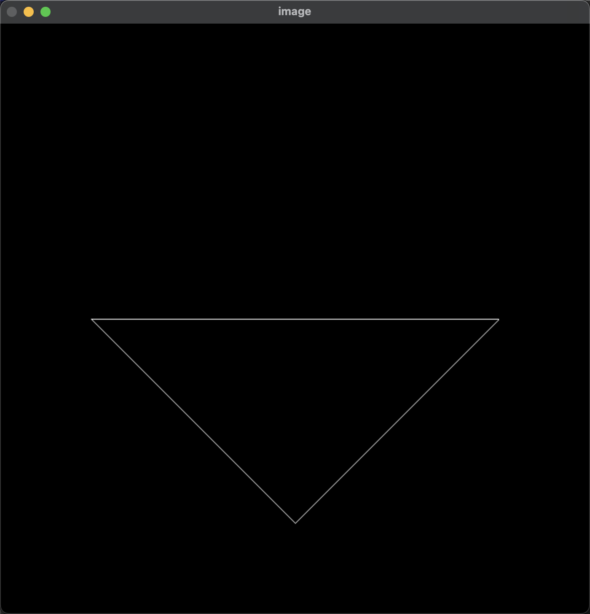
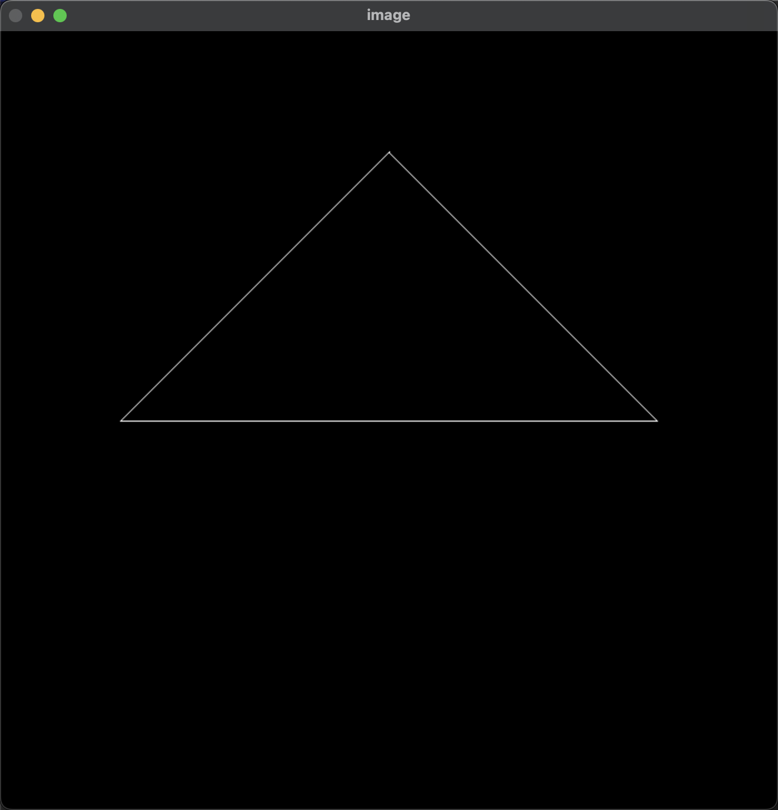

<!-- more -->

## Model_Matrix

模型矩阵意在将模型空间中的坐标映射到世界空间

$$
M_{Model \rightarrow World} = T_{Matrix} * R_{Matrix} * S_{Matrix}
$$

遵循先缩放，后旋转，再平移的顺序

## View_Matrix

视图矩阵意在将世界空间中的坐标映射到观察空间  

### **0.分析**

当摄像机拍摄某一个物体时，如果摄像机的位置和朝向发生了变化，则成像也会变化。  
但是如果给物体施加以和摄像机相同的变换，则成像就不会发生变化。  
即当相机和物体的相对位置没有发生变化的时候，成像不变。

因此，我们可以将摄像机的的位置，变换到原点，并将旋转归零。  
再将相同的变换操作应用到物体上，即可得到物体的观察空间坐标。

### **1.先将摄像机位置归于原点**

摄像机的位置 $(Eye_x, Eye_y, Eye_z)$  
则将摄像机归于原点的变换矩阵为：

$$
T_{Matrix} = 
\begin{bmatrix}
1 & 0 & 0 & -Eye_x \\
0 & 1 & 0 & -Eye_y \\
0 & 0 & 1 & -Eye_z \\
0 & 0 & 0 & 1
\end{bmatrix}
$$

### **2.将摄像机的旋转归零**

继续分析，以X轴方向为例。  
其实我们很难将 摄像机空间中的X轴方向 变换到 世界空间中的X轴方向 
$$
\vec{View_X} \rightarrow \vec{World_X}
$$

但是，反过来想，我们却可以很轻易地做到
$$
\vec{View_X} \leftarrow \vec{World_X}
$$
我们将X轴视为右方向，则可以有
$$
\begin{bmatrix}
    ViewRight_x & 0 & 0 & 0 \\
    ViewRight_y & 0 & 0 & 0 \\
    ViewRight_z & 0 & 0 & 0 \\ 
    0 & 0 & 0 & 1
\end{bmatrix}
\begin{bmatrix}
1 \\
0 \\
0 \\
0
\end{bmatrix}
= \begin{bmatrix}
ViewRight_x \\
ViewRight_y \\
ViewRight_z \\
0
\end{bmatrix}
$$

然后我们将这个简单的操作重复到Y轴和Z轴上，即可得到旋转矩阵
$$
M_{World \rightarrow View} =
\begin{bmatrix}
    ViewRight_x & ViewUp_x & -ViewForward_x & 0 \\
    ViewRight_y & ViewUp_y & -ViewForward_y & 0 \\
    ViewRight_z & ViewUp_z & -ViewForward_z & 0 \\
    0 & 0 & 0 & 1
\end{bmatrix}
$$

又因为旋转矩阵的特殊性，即旋转矩阵的逆矩阵等于旋转矩阵的转置矩阵，因此我们便得到了我们想要的矩阵

$$
M_{View \rightarrow World} = M_{World \rightarrow View}^{-1} = M_{World \rightarrow View}^T
$$

$$
= \begin{bmatrix}
    ViewRight_x & ViewRight_y & ViewRight_z & 0 \\
    ViewUp_x & ViewUp_y & ViewUp_z & 0 \\
    -ViewForward_x & -ViewForward_y & -ViewForward_z & 0 \\
    0 & 0 & 0 & 1
\end{bmatrix}
$$

注：方向向量都是单位向量  
注：forward是负数，是约定了相机看向-z方向，forward = target - eye

### **3.结论**

由以上步骤，我们得到最终的View_Matrix

$$
View_{Matrix} = R_{Matrix} * T_{Matrix}
$$

## Projection_Matrix

投影矩阵意在将观察空间中的坐标映射到裁剪空间（Clip Space）  
投影分为两种类型，正交投影，和透视投影

### **1.正交投影**

在图形学中，我们借助构建标准立方体[-1,1]，来确定投影范围

确定投影空间的边界，有如下参数（参数来源自摄像机）  
l : 左  
r : 右  
t : 上  
b : 下  
n : 近平面  
f : 远平面  

先将标准立方体位移至原点
$$
T_{Matrix} = \begin{bmatrix}
    1 & 0 & 0 & -\frac{l + r}{2} \\
    0 & 1 & 0 & -\frac{t + b}{2} \\
    0 & 0 & 1 & -\frac{n + f}{2} \\
    0 & 0 & 0 & 1
\end{bmatrix}
$$

然后在缩放至标准立方体的大小  
大小是[-1，1]，所以每个边界的长度是2
$$
S_{Matrix} = \begin{bmatrix}
    \frac{2}{r - l} & 0 & 0 & 0 \\
    0 & \frac{2}{t - b} & 0 & 0 \\
    0 & 0 & \frac{2}{n - f} & 0 \\
    0 & 0 & 0 & 1
\end{bmatrix}
$$

最后我们就得到了正交投影矩阵
$$
M_{Orthographic} = S_{Matrix} * T_{Matrix}
$$

### **2.透视投影**

关于透视投影，我们可以先将透视投影的视锥体(frustom)的远平面"挤压"，将远平面的大小变换成与近平面相同，再乘以我们已经知晓答案的正交投影矩阵，即可完成透视投影矩阵

根据下图的相似三角形

我们可以很轻易地得出X和Y经过变化后的结果，即
$$
\begin{CD}
    \begin{bmatrix}
        x \\ y \\ z \\ 1
    \end{bmatrix} 
@>{\text{透视->正交}}>> 
    \begin{bmatrix}
        \frac{n}{z}x \\
        \frac{n}{z}y \\
        ? \\
        1
    \end{bmatrix}
@>{\text{齐次除法}}>>
    \begin{bmatrix}
        nx \\ ny \\ ? \\ z
    \end{bmatrix}
\end{CD}
$$

由此，我们可以先推到出部分透视->正交矩阵，即
$$
\begin{CD}
    \begin{bmatrix}
        n,0,0,0 \\
        0,n,0,0 \\
        ?,?,?,? \\
        0,0,1,0
    \end{bmatrix}
    \begin{bmatrix}
        x \\ y \\ z \\ 1
    \end{bmatrix}=
    \begin{bmatrix}
        nx \\ ny \\ ? \\ z
    \end{bmatrix}
\end{CD}
$$

接下来，将要推导Z的部分，通过分析 [透视->正交变换示意图]  
我们可以得到如下两条结论:  
1.通过透视->正交矩阵变换后，近平面上的任意点，没有发生任何变化  
2.通过透视->正交矩阵变换后，远平面上的中心点，没有发生任何变化

根据1结论，我们可以得出如下推导
$$
\begin{CD}
    \begin{bmatrix}
        x \\ y \\ n \\ 1
    \end{bmatrix}
@>{\text{透视->正交}}>>
    \begin{bmatrix}
        x \\ y \\ n \\ 1
    \end{bmatrix}
@>{\text{齐次除法}}>>
    \begin{bmatrix}
        nx \\ ny \\ n^2 \\ n
    \end{bmatrix}
\end{CD}
$$

根据上面的推导，我们可以进一步假设透视->正交矩阵的一部分
$$
\begin{bmatrix}
    n,0,0,0 \\ 
    0,n,0,0 \\
    0,0,A,B \\
    0,0,1,0
\end{bmatrix}
\begin{bmatrix}
    x \\ y \\ n \\ 1
\end{bmatrix} = 
\begin{bmatrix}
    nx \\ ny \\ An + B \\ n
\end{bmatrix} = 
\begin{bmatrix}
    nx \\ ny \\ n^2 \\ n
\end{bmatrix}
$$

进而得出等式1：  
$An + B = n^2$

根据2结论，我们可以得出如下推导
$$
\begin{CD}
    \begin{bmatrix}
        0 \\ 0 \\ f \\ 1
    \end{bmatrix}
@>{\text{透视->正交}}>>
    \begin{bmatrix}
        0 \\ 0 \\ f \\ 1
    \end{bmatrix}
@>{\text{齐次除法}}>>
    \begin{bmatrix}
        0 \\ 0 \\ f^2 \\ f
    \end{bmatrix}
\end{CD}
$$

根据上面的推导，我们可以进一步假设透视->正交矩阵的一部分
$$
\begin{bmatrix}
    n,0,0,0 \\
    0,n,0,0 \\
    0,0,A,B \\
    0,0,1,0
\end{bmatrix}
\begin{bmatrix}
    0  \\ 0 \\ f \\ 1
\end{bmatrix} = 
\begin{bmatrix}
    0 \\ 0 \\ Af + B \\ f
\end{bmatrix} = 
\begin{bmatrix}
    0 \\ 0 \\ f^2 \\ f
\end{bmatrix}
$$

进而得出等式2：  
$Af + B = f^2$

至此，我们的除了两条等式，求解即可得到$AB$  
$$
\begin{cases}
    An + B = n^2 \\
    Af + B = f^2
\end{cases} = 
\begin{cases}
    A = n+f \\
    B = -nf
\end{cases}
$$

最终我们得到了完成的透视->正交矩阵
$$
M_{Perspective \rightarrow Orthographic} = 
\begin{bmatrix}
    n,0,0,0 \\
    0,n,0,0 \\
    0,0,n+f,-nf \\
    0,0,1,0
\end{bmatrix}
$$

### **3.结论**
$$
M_{Projection} = 
M_{Orthographic} * M_{Perspective \rightarrow Orthographic} 
$$

## 写在最后
以上推导过程，来自Games101课程  
虽然过程没有任何问题  
但是，在做作业01的时候，发现作业的代码，如果完全按照课程推导出的矩阵带入的话，得到的结果会颠倒，如图

通过查阅资料，和自己的一点点思考后，发现，问题出在$z$上  
因为在视图变换中，我们规定相机看向了$-z$方向，于是当程序进行最终的齐次除法时，物体的$z$始终是负数,也就是$w$分量，这就出现了如下的结果：  
$$
\begin{bmatrix}
    x \\ y \\ z \\ w
\end{bmatrix} = 
\begin{bmatrix}
    x/w \\ y/w \\ z/w \\ 1
\end{bmatrix}
$$

$w$分量为负数，导致了颠倒  
我个人是简单地将【透视->正交矩阵】做了一点简单的修改
$$
\begin{bmatrix}
    n,0,0,0 \\
    0,n,0,0 \\
    0,0,n+f,-nf \\
    0,0,1,0
\end{bmatrix} =>
\begin{bmatrix}
    n,0,0,0 \\
    0,n,0,0 \\
    0,0,n+f,-nf \\
    0,0,-1,0
\end{bmatrix}
$$
这样即可得到正确的结果:

也有文章指出，是因为参数中的 $zNear = 0.1$ 和 $zFar = 50$ (正数的原因)，有人将这两个参数改为负数一样可以得到正确的结果  

但是我认为，这种做法，还有包括我的做法，都是不太对的。  
另有文章指出，《虎书》中推导的矩阵代入程序也是正确的。  

其实到这一步还没学习到光栅化，深度测试等内容，所以，无所谓啦，之后也得再看看《虎书》的。

**最后!!!**

关于图形学的学习，其实很早很早就开始了，但也总是中断，都没有坚持。加上工作忙且与渲染相关的需求其实并不多，就一直搁置，希望这次可以好好学到底，加油哦～

引用图形学里一句经典的话

$$
计算机图形学第一准则：近似原则如果它看上去是对的它就是对的
$$

