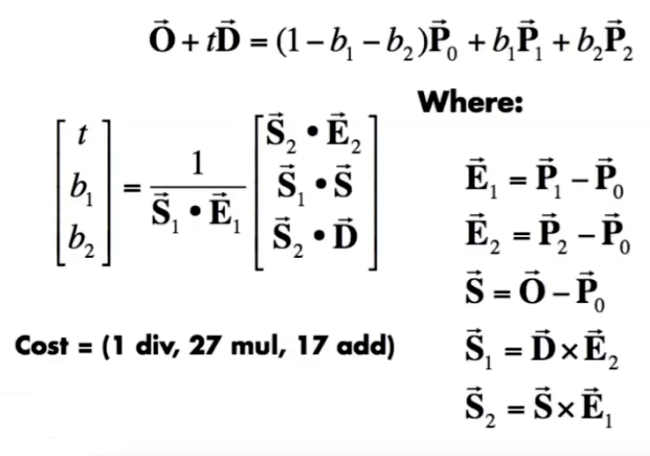
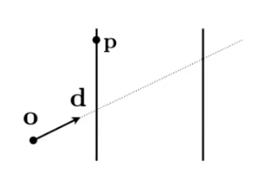
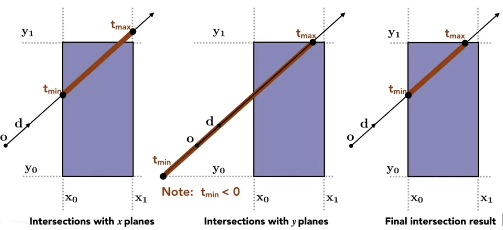
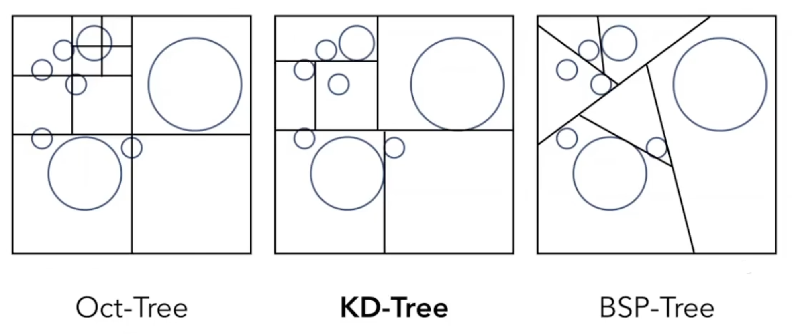
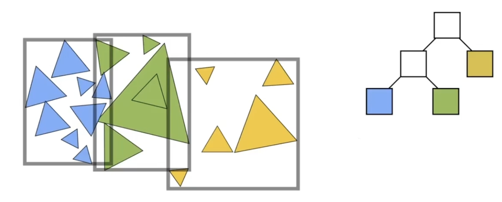

<!-- more -->

## Whitted-Style Ray Tracing

Whitted-Style 递归算法 

是以相机为原点，向屏幕中的每一个像素画一条射线  
射线打到物体上后，根据物体的特性，进行额外的反射或折射计算（代表射线可能会有多次弹射）  
最终再射向光源，以确认光照性的一个过程  
这个算法，利用了光路可逆性，以摄像机为起点，对每一个像素方向进行一个射线检测（模拟光路），以此来确定像素的颜色  
光线追踪可以实现，普通光栅化渲染流程无法实现的，体现物体与物体之间相互影响的关系

所以首先需要的是，射线与物体之间的交点计算

## 对于一般性的隐式表面

射线的定义 $r(t)=o+td, 0 < t < \infty$  
隐式表面方程 $p:f(p)=0$  
交点 $f(o + td) = 0$  

## 对于 Polygon Mesh 的显式表面

对于一个由三角形构成的模型而言，我们需要判断的是，射线是否相交于三角形

射线与三角形的相交判断  
分为两个步骤
- 射线于三角形所在面的交点
- 该交点是否在三角形内（方法已知，循环叉乘判断左右）

对于第一个步骤而言，我们需要先确定的是如何定义一个平面
- 平面的法线方向$N$
- 平面上的任意一点$P$

对于在平面上的任意点$Q$，都满足$(Q-P)·{N}=0$  
射线的定义 $r(t)=o+td, 0 < t < \infty$  
由此可得  
$(Q-P)·N = (o + td - P)·N = 0$  
$t = (P - o)·N / (d·N)$

至此，就得到了射线于平面的交点  
接下来对焦点做三角形内判断即可

## Möller Trumbore Algorithm
射线三角形求交公式

$$
\vec{O} + t\vec{D} = (1-b_1-b_2)\vec{P_0} + b_1\vec{P_1} + b_2\vec{P_2}
$$

## 加速

单根射线遍历三角形的运算量过于巨大，可以通过构建包围盒来预剔除一些不可能与射线交互的物体

Axis-Aligned Bounding Box(AABB)  
轴对齐包围盒

射线的定义 $r(t)=o+td, 0 < t < \infty$  

对于单轴（X轴举例）而言  
与AABB在X轴上的交点，处于$t_x$上  

$$t_x = \frac{P.x - o.x}{d.x}$$

随后对三个轴都进行一次操作，每个轴都会与轴平面相交两次  
得到$t_{min}$ 和 $t_{max}$  
做交集得出：  
$t_{enter} = \max(t_{min})$  
$t_{exit} = \min(t_{max})$  

最后满足条件
$$t_{enter} < t_{exit}\And\And t_{exit} >= 0$$ 
即视为射线与物体有可能相交

## 空间划分 Spatial Partitioning

- Oct-Tree 八叉树
- KD-Tree KD树
- BSP-Tree BSP树

这个并不深究，因为这个算法已经过时了

## 物体划分 Object Partitioning

- BVH Bounding Volume Hierarchy 

按照物体分堆,均匀的划分空间，形成可重叠的包围盒