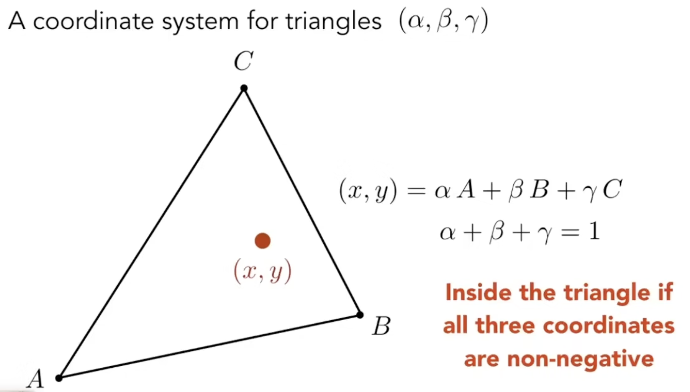
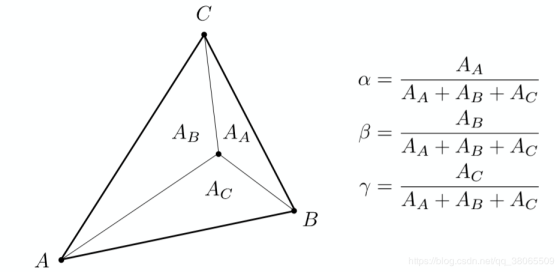
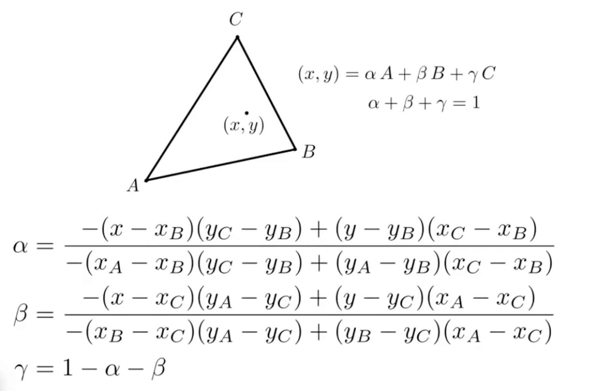

<!-- more -->

## Shading Frequency

Flat Shading 
逐平面（face）着色

Gouraud Shading
逐顶点（vertex）着色

Phong Shading
逐像素（pixel）着色

### 顶点法线

顶点法线 = 顶点相邻面法线之和

$$
N_{vertex} = \frac{\sum_{i}N_i}{|\sum_{i}N_i|}
$$

注：根据相邻面的面积，做加权平均效果会更好

### 像素法线（插值）

barycentric interpolation (重心插值)  
barycentric coordinates (重心坐标)

对于三角形内的任意一个点$(x,y)$ 都可以有一个对应的重心坐标$(\alpha,\beta,\gamma)$,且满足如下式子  
$(x,y)=\alpha(x_A,y_A)+\beta(x_B,y_B)+\gamma(x_C,y_C)$  
$\alpha+\beta+\gamma=1$

关于计算重心坐标，如下图所示  
三角形顶点对面的小三角形（A顶点的对面小三角形就是$A_A$）  
占总面积的比值

根据叉乘，可以算出三角形的面积，所以有

通过计算即可得出在三角形内任意点(x,y)的$\alpha,\beta,\gamma$值，对应了该点对于三角形三个顶点的权重  
该点的数据，可以通过$\alpha,\beta,\gamma$作为权重，计算出对应的属性（法线，颜色等信息）

## 渲染管线

在工业生产中，渲染管线基本被固定为了如上图所示的流程中  
流程中的各个部分，都是由硬件实现好了的，只开放了两个可编程的部分  
顶点着色器（ Vertex Shader ）  
片元着色器（ Fragment Shader ）