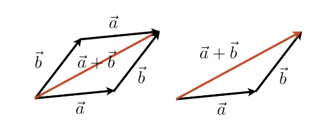
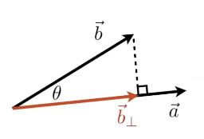
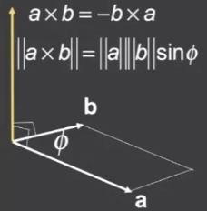

<!-- more -->

## 定义
点 *A* = $(x_a, y_a)$, *B* = $(x_b, y_b)$

*A* 指向 *B* 的向量为

$\vec{a}$ = $\overrightarrow{AB}$ = *B* - *A*

## 向量的模(长度)

$\vec{a}$ 的模 = $||\vec{a}||$ = $\sqrt{x_a^2 + y_a^2}$

## 单位向量

Unit Vector 是长度为 1 的向量

向量 $\vec{a}$ 的单位向量为
$\hat{a}$ = $\frac{\vec{a}}{||\vec{a}||}$

## 向量加法

$\vec{a} + \vec{b}$ = $(x_a + x_b$, $y_a + y_b)$

### 几何意义
  

## 向量乘法_点乘

$$\vec{a} \cdot \vec{b} = ||\vec{a}|| ||\vec{b}|| cos\theta$$

$$cos\theta = \frac{\vec{a} \cdot \vec{b}}{||\vec{a}|| ||\vec{b}||}$$

- For Unit Vectors

$$cos\theta = \hat{a} \cdot \hat{b}$$

向量点乘的结果，是一个标量

### 点乘的基本属性

$\vec{a} \cdot \vec{b} = \vec{b} \cdot \vec{a}$

$\vec{a} \cdot (\vec{b} + \vec{c}) = \vec{a} \cdot \vec{b} + \vec{a} \cdot \vec{c}$

$(k\vec{a}) \cdot \vec{b} = \vec{a} \cdot (k\vec{b}) = k(\vec{a} \cdot \vec{b})$

### 代数计算 (3D同理)

$\vec{a}\cdot\vec{b}$
= $\begin{pmatrix}
    x_a \\
    y_a
\end{pmatrix}$
$\cdot$
$\begin{pmatrix}
    x_b \\
    y_b
\end{pmatrix}$
= $(x_a x_b + y_a y_b)$

### 几何意义

$\vec{a}\cdot\vec{b}$ 的几何意义为 

$\vec{b}$ 在 $\vec{a}$ 方向上的投影的长度 乘以 $||\vec{a}||$

另外有

根据投影几何意义或$cos\theta$都可简单得出如下结果

$\vec{a}\cdot\vec{b} = ||\vec{a}||||\vec{b}||$ 时 $\vec{a}$ 与 $\vec{b}$ 相互平行

$\vec{a}\cdot\vec{b} > 0$ 时 $\vec{a}$ 与 $\vec{b}$ 的夹角为(0,90)

$\vec{a}\cdot\vec{b} = 0$ 时 $\vec{a}$ 与 $\vec{b}$ 相互垂直

$\vec{a}\cdot\vec{b} < 0$ 时 $\vec{a}$ 与 $\vec{b}$ 的夹角为(90,180)

### 证明

如图所示

设$\vec{b}_\bot$ 为 $\vec{b}$ 在 $\vec{a}$ 方向上的投影

$\because \vec{a}\cdot\vec{b} = ||\vec{a}|| ||\vec{b}|| cos\theta$

$\therefore \vec{a}\cdot\vec{b} = ||\vec{a}|| ||\vec{b}|| \frac{||\vec{b}_\bot||}{||\vec{b}||}{}$

$\therefore \vec{a}\cdot\vec{b} = ||\vec{a}|| ||\vec{b}_\bot||$

$\therefore \vec{a}\cdot\vec{b} = \vec{b} 在 \vec{a} 方向上的投影 * ||\vec{a}||$

## 向量乘法_叉乘

叉乘是三维和七维空间特有的

### 几何意义

$\vec{a}\times\vec{b}=\vec{c}$

$\vec{c}同时垂直于\vec{a}和\vec{b}$

$||\vec{c}|| = ||\vec{a}|| ||\vec{b}|| sin\phi$

还可以通过$\vec{c}$的方向，$\vec{b}$在$\vec{a}$ 的左侧或右侧

向量叉乘的结果，是一个向量

对于二维向量而言，两个向量叉乘的结果的模，等于这两个向量构建出来的平行四边形的面积  
计算方式，是将z=0，再代入三维计算

### 左/右手坐标系

$\vec{x}\times\vec{y}=\vec{z}$
满足左/右手螺旋定则

就表示当前坐标系是左/右手坐标系
- Unity中的坐标系是左手坐标系
- 当前课程【Games101】使用右手坐标系

### 基本属性

$\vec{a}\times\vec{b} = -\vec{b}\times\vec{a}$

$\vec{a}\times\vec{a}=\vec{0}$ 零向量

$\vec{a}\times(\vec{b}+\vec{c})=\vec{a}\times\vec{b}+\vec{a}\times\vec{c}$

$\vec{a}\times(k\vec{b})=k(\vec{a}\times\vec{b})$

### 代数计算

$$
\vec{a}\times\vec{b} = 
\begin{pmatrix}
    y_a z_b - z_a y_b \\ 
    z_a x_b - x_a z_b \\ 
    x_a y_b - y_a x_b
\end{pmatrix}
$$

- 记忆方法，交叉相乘（仔细观察）
$\vec{a}\times\vec{b} = \vec{c}$
$$
\begin{bmatrix}
    x_c & y_c & z_c \\
    x_a & y_a & z_a \\
    x_b & y_b & z_b
\end{bmatrix}
$$ 