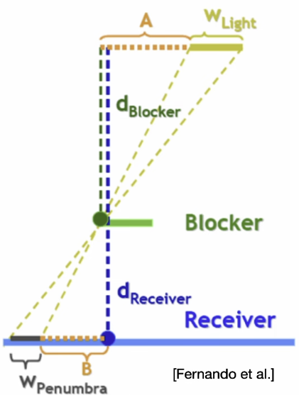
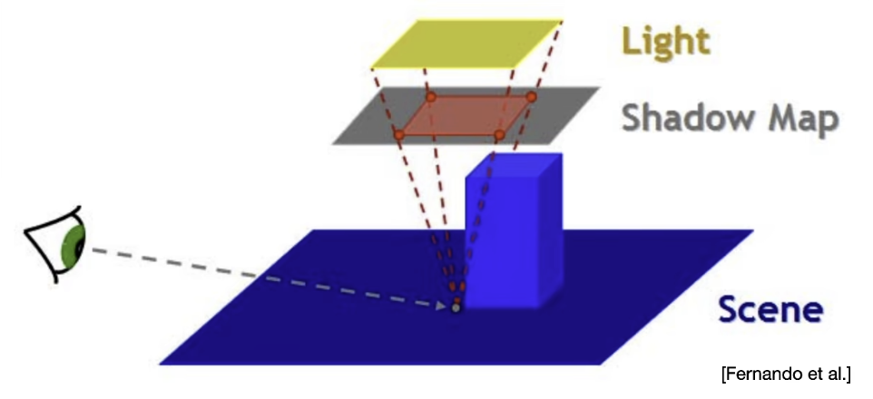

<!-- more -->

## Shadow Mapping

阴影贴图

从光源出发，对场景进行一次渲染，只记录深度，生成阴影贴图  
在实际渲染中，根据framgment的世界坐标，经过light_vp转换得到shadow_coord
进而读取阴影贴图，得到阴影值

### 缺陷 Self Occlusion

自遮挡

* 原因

阴影贴图也是有分辨率限制的，而一个分辨率对应去区域，该区域的深度是同一个值，且该区域的深度值是该区域所有物体的深度值中的最小值，若该区域是一个平面，那么这个渲染这个平面时，只有最靠近光的一小部分，被认为是没有阴影的，而剩余部分则都会处于阴影中

* 解决

使用一个Shadow Bias 阴影容差。即在进行阴影的深度测试时，使用一个容差值，来避免自遮挡现象，误差小于bias的部分，不算在阴影中

* 进一步解决

可以发现，当光源完全垂直照射一个平面时，Self Occlusion现象是不存在的，所以对于Shadow Bias 的取值，可以根据光源与平面的夹角进行动态调整，即夹角越小，Bias越大

* 非工业可用的学术级解决方案（题外话）

Second-depth Shadow Mapping

使用最小和次小的深度的中间值来作为阴影判定深度。

在实时渲染中，开销过于大，不会再工业中采用

* 自遮挡问题总结

自遮挡问题，从来都没有一个完美的解决方案，通常的，是找到一个合适Bias和Slop，以做到合适的结果即可

## PCF

Percentage closer filtering 

阴影抗锯齿

就像素点对阴影贴图进行采样时，采7x7的阴影深度并进行平均，多重采样，模糊

## PCSS

Percentage closer soft shadow

基本原理依然是使用PCF对阴影进行多重采样，但是Filter的大小是动态的，根据点与(面)光源所形成的锥体的范围

* Filter Size  
  
FilterSize 的计算公式如下

$$半影大小 = w_{Penumbra} = (d_{Receiver} - d_{Blocker})\cdot w_{Light}/d_{Blocker}$$

在公式中，$d_{Blocker}$项依旧是像素点对应的阴影图进行多重采样取得平均深度，需要一个$d_{Blocker}$ Sample Size

这个Size可以用下图示例的方法来确定

* 总结PCSS
  * 1.对shadow map 进行多采样，找到平均深度
  * 2.通过半影公式求出半影大小，半影大小=PCF Filter Size
  * 3.通过PCF采样shadow map

## VSSM

Variance（方差） soft shadow mapping

在PCSS中的1（Average Block Depth）、3（PCF）步骤中，均发生了多次采样，增加了性能压力

为此，可以做如下优化

### 对于步骤3的优化

步骤3，简而言之，就是在一个区域内找出比当前深度浅的概率。

* 切比雪夫不等式 Chebyshev's inequality

$$P(X \ge t)  \le \frac{\sigma^2}{\sigma^2 + (t - \mu)^2}(t > \mu)$$

$\mu$ 均值  
$\sigma^2$ 方差  
$P(X \ge t)$ 比t大的概率  

通过切比雪夫不等式。我们只需要通过采样区域内的均值和方差，即可算出比采样深度大的概率，即PCF

* 均值$\mu$ 可以通过生成mipmap(快速。近似。限定方形，不精准)或Summed Area Table(SAT)(准确，但是计算量大)来获取

* 方差  
$$\sigma^2 = E(X^2)-E(X)^2$$

切比雪夫不等式计算PCF，当Shadow Caster和Receiver满足Planarity时，才相等

这一步骤称为Variance Shadow Mapping (VSM)

### 对于步骤1的优化

相同的，对于步骤1，与步骤3不同的是，多了一项Block Search。

即，步骤1只需要取所有Blocker的深度

$$\frac{N_1}{N}Zunocc + \frac{N_2}{N}Zocc = Zavg$$

$Zavg$ 为区域内深度均值，已知项  
$Zocc$ 为区域内遮挡物的深度均值  
$Zunocc$ 为区域内非遮挡物的深度均值  
$\frac{N_1}{N}$ 为$Zunocc$（$z>t$）的概率,即$P(X>t)$  
$\frac{N_2}{N}$ 为$Zocc$（$z<t$）的概率,即$1 - P(X>t)$  

要计算$Zocc$，还差最后一项，$Zunocc$。  
进一步假设$Zunocc$,即所有$z>t$的部分，$Zunocc = t$  
即假设所有非遮挡物($Zunocc$)的深度=t(测试深度)

至此就可以算出步骤1需要的Zocc

### 缺点

使用切比雪夫不等式，近似计算分布概率，在分布函数呈正态分布（单峰）时，结果才会有效近似

## MSM

Moment Shadow Mapping

大概就是在上面计算方差的地方，使用到了$X^2$，而MSM则使用了$X^4$，是一种更高阶的展开  
这导致上述的所有计算公式，都变得非常复杂，推导困难

Games202没讲，也不打算看了