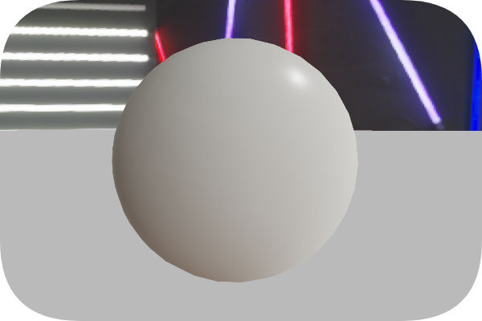
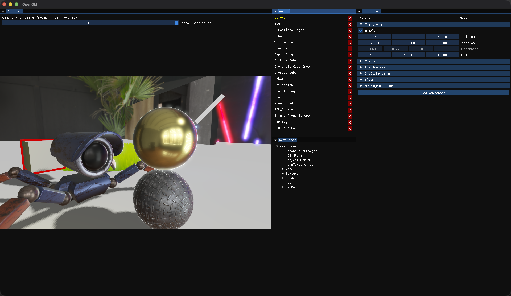

<!-- more -->

## “直言不会”

Physically Based Rendering 基于物理的渲染

在网上能找到许多PBR相关的文章，诸如《猴子都能看懂的PBR》，《草履虫都能看懂的PBR》，总感觉人人都会PBR，PBR就是基础标配，PBR就是入门，不会就是“菜”。

<font color=#00aa00>// 注：此处列举的文章或类似文章，并没有贬义的意思。</font>

但是，我不会。不会就是不会，不会就老老实实地实践一遍。

本文不算是教程，并不能完美地讲解所有PBR相关的细节（太菜了），更难以还原PBR的发展历史。本文仅旨在记录一次实践，一次理论到工程的实践，且尽可能地解释理论部分，但不包含任何随处可见的理论解释图例（不想做搬运工）。

本文就当作2025年的学习总结吧。

PBR需要的前置知识包括但不限于：微积分，立体角，辐射度量学，能量守恒，微表面理论

## PBR背景
远古时期的图形学渲染领域，人们使用Lambert，Half-Lambert漫反射，Phong，Blinn-Phong的高光等渲染模型进行渲染，当时的美术们通过各种物理意义不明的魔法参数对渲染结果进行调整，这是一种模糊的调整材质的方式，所以也应证了那句名言。
$$\text{If it looks right, it's right.}$$  
但是这可无法满足人们的需求，于是人们不禁发问：如何让物体渲染得更加真实？  
而为了回答这个问题，图形学开始了漫长的征程。  
其中的一些重要节点如下：  
1. 辐照度量学的引入，开始将“光”这一模糊的概念，数值化
2. 微平面理论的提出，提供了一种能量守恒的方式，使用具有物理意义Roughness(粗糙度)描述材质
3. 继续为了能量守恒，进一步引入Metallic(金属度)参数
4. 渲染方程的提出，提供了一个引入辐照度概念的，能量守恒的渲染公式。

以上就是为了解决渲染更真实而一步步发展而出的一系列理论，也是PBR渲染基础知识。

关于PBR的背景知识，并不打算做过多的介绍，我也理不清，也不是考古。很多文章都有相关理论的更详尽的介绍，这些都是必要的前置知识，可自行查阅其他相关文章。

在我看来，PBR的历史，更像是一个有趣的故事，相关理论并不复杂，但也需要了解。且需要记住一个重点，基于物理的渲染，最基本的要求是要符合能量守恒。

本文重点在于记录一次理论到工程的实践。

## 渲染方程

$$ L_o(p,w_o) = L_e(p,w_o) + \int_{\Omega} f_r(p,w_o,w_i) L_i(p,w_i) (n \cdot w_i)\text{d}w_i$$

::: details 渲染方程解释
$$ \underbrace{L_o(p,w_o)}_{出射光颜色} = \underbrace{L_e(p,w_o)}_{自发光颜色} + \underbrace{\int_{\Omega}}_{半球领域积分} \underbrace{f_r(p,w_o,w_i)}_{BRDF} \underbrace{L_i(p,w_i)}_{入射光颜色} \underbrace{(n \cdot w_i)}_{Lambert's Law}\text{d}w_i$$

能量角度的另一种解释：点p先接受到所有方向而来的Radiance得到一个总的Irradiance，然后通过$f_r$决定能量如何发散

:::

重点在于$f_r$函数，即双向反射分布函数（BRDF），它描述了物体是如何反射能量（光）的。一般的PBR实现，采用Cook-Torrance BRDF。式子长这样

$$ f_r(p,w_o,w_i) = k_d\frac{c}{\pi} + k_s\frac{DFG}{4(n \cdot w_o)(n \cdot w_i)} $$

::: details BRDF 基础解释
$c$   材质颜色  
$k_d$ 材质漫反射系数  
$k_s$ 材质镜面反射系数  
$w_o$ 出射光方向(观察方向)  
$w_i$ 入射光方向（光源方向）
:::

先去掉自发光项（自发光就是一个追加的颜色，实现很简单的），将Cook-Torrance BRDF带入渲染方程，得到：
$$ L_o(p,w_o) =\int_{\Omega} (k_d\frac{c}{\pi} + k_s\frac{DFG}{4(n \cdot w_o)(n \cdot w_i)}) L_i(p,w_i) (n \cdot w_i)\text{d}w_i$$

解渲染方程就是求积分，积分是一个“累加”的过程，就是半球领域上，所有方向来的入射光对特定出射方向（观察方向）的“贡献”的和，就是积分的结果。

还有一个非常重要的细节：PBR要求在线性空间中计算，这个前置条件不满足的话，实现了也白瞎。关于线性空间，gamma空间，有时间再另起一篇吧。（难说

接下来由简入繁，一一拆解：

## 直接光--漫反射

直接光是确定入射方向的，所以积分过程退化成了离散的若干个确定方向的直接光的累加。  
例如对于单个直接光而言，积分退化成了一个方向的“累加”（除光源方向外，其他所有方向贡献的能量为0）
$$ L_o(p,w_o) = (k_d\frac{c}{\pi} + k_s\frac{DFG}{4(n \cdot w_o)(n \cdot w_i)}) L_i(p,w_i) (n \cdot w_i)$$

先简单过一下两个系数，在能量守恒的前提要求下：$k_s + k_d=1$，目前仅需要知道这个即可。

再看看漫反射的计算式$\frac{c}{\pi}$，为什么呢？

::: details Games系列中的解释
在Games系列中，对于漫反射项的解释如下：  
漫反射是不吸收任何能量的，均匀地向半球的所有方向发散的。  
假设半球领域所有方向而来的入射光是一样的。则有

$L_o = L_i$  
所有方向入射光都相同，且漫反射不吸收能量，则同样相等于所有方向的出射光。

$$L_o = \int_{\Omega} f_r L_i (n \cdot w_i)\text{d}w_i$$  
$$L_o = \underbrace{f_r L_i}_{常数项} \int_{\Omega} \cos \theta \text{d}w_i$$
$$L_o = f_r L_i \underbrace{\int_{0}^{2\pi}\int_{0}^{\frac{\pi}{2}} \cos \theta \sin \theta \text{d}\theta \text{d}\phi}_{立体角积分}$$

计算内层积分，令$u = \sin \theta$，$\text{d}u = \cos \theta \text{d}\theta$，积分范围变成$u(0) = 0,u(\frac{\pi}{2}) = 1$，有

$$\int_{0}^{2\pi}\text{d} \phi \int_{0}^{1}u\text{d}u = 2\pi \frac{1}{2} = \pi$$

// 这个积分计算是整个PBR实现流程中，唯一有解析解的积分了，且算且珍惜，后面都是妖魔鬼怪。

$$L_o = f_r L_i \pi$$

$$\because L_o = L_i$$
$$\therefore f_r = \frac{1}{\pi}$$
:::

当初我看到这的时候我对于这个解释并不满意，并不是说它不对，而是我觉得可以有更“好”的解释。  
而至于为什么我个人认为更好，因为这个解释在后面可以直接使用  

::: details 我的解释 结果都一样的。

当前我们计算的是直接光，单光源，所以我们依旧按照单光源的设定进行计算。  
出发点：能量守恒。  
1. 单光源对点$p$的Irradiance = 假想均匀入射光源对点p的Irradiance  
2. 假想均匀入射的Radiance = 均匀出射的Radiance（漫反射设定）   
单个光源的入射能量Irradiance为：(注意不是Radiance,是Irradiance)（单光源积分退化为一项的累加）

$$E_{单光源} = L_{单光源}\cos \theta$$

首先，漫反射设定是不吸收任何能量的，均匀地向半球发散的。  
假设入射光亦是均匀的，所有$L_o = L_i$，入射即出射，我们可以计算点p的Irradiance。

$$E_{均匀入射} = \int_{\Omega} L_{均匀入射} \cos \theta \text{d}w_i = L_{均匀入射} \cdot \pi = L_{均匀出射} \cdot \pi$$

实际的$E_{单光源}$应该等于我们假设中的$E_{均匀入射}$，所以有$L_{单光源}$和$L_{均匀出射}$的关系是：

$$L_{均匀出射} \cdot \pi = L_{单光源}\cos \theta$$
$$L_{均匀出射} = \frac{1}{\pi} L_{单光源}\cos \theta$$  

所以单个直接光到均匀出射的关系比例是$\frac{1}{\pi}$，这个就是我们找的$f_r$
:::

现在我们知道了在漫反射的设定中，单个光源到均匀出射的转换比例，但是别忘了把漫反射颜色$c$带上。

### 理论到工程
到此我们可以想讲直接光漫反射由理论到工程了

``` GLSL
void main()
{
    // ...

    // albedo
    vec4 textureColor = texture(mainTexture, uv);

    // 镜面反射=0
    vec3 ks = 0;
    // 先完全展示漫反射
    vec3 kd = 1;

    // diffuse
    // 直接光，漫反射
    vec3 direct_Diffuse = kd * textureColor.rgb / PI;
    // 直接光，镜面反射 = 0
    vec3 direct_Specular = vec3(0.0);

    // 单光源，积分退化为一项
    vec3 direct_Color = (direct_Diffuse + direct_Specular) * lightColor * NdotL;

    FragColor = vec4(direct_Color,1.0);
}
```


## 直接光--镜面反射

由简入繁，接下来到看起来很吓人的高光项了。

$$ L_o(p,w_o) = (k_d\frac{c}{\pi} + k_s\frac{DFG}{4(n \cdot w_o)(n \cdot w_i)}) L_i(p,w_i) (n \cdot w_i)\text{d}w_i$$

### PBR 工作流
首先我们要介绍接下来需要使用到的两个参数
1. 粗糙度 Roughness 描述了材质有多粗糙
2. 金属度 Metallic   描述了材质有多金属

::: details PBR工作流
在各种内置了PBR渲染的软件里，都会标注自己的PBR工作流如：Specular-Glossiness工作流。  
而本篇文章是基于【LearnOpenGL】和【Real Shading in Unreal Engine 4】文章进行编写的  
所以本片文章会如上述两篇文章中实现的那样，使用Metallic-Roughness工作流  
:::

这两个参数，从名字上来看，非常的直观，且两个项独立互不影响，非常适合予美术使用。  
但是我们是程序，我们要做的是实现这两个参数，让这两个参数起作用。（悲

### 微平面理论
其次我们再简单介绍一下微平面理论

::: details 微平面理论
微平面理论认为，所有平面，在微观尺度下，都是由许多个凹凸不平的，拥有完美镜面反射能力的微小平面组成。即引入了粗糙度参数，用于描述微平面的属性。
:::

好像有点太简单了，算了，稍后具体使用到的地方，会稍微的进一步讲解     
想看详细理论的可以看别的文章，我不想做搬运工了


### D Term
D项的全称为：法线分布函数（Normal Distribution Function）  
简称：NDF  
函数写作：$D(n,h,roughness)$  

::: details 法线分布函数 理论
首先我们来回忆一下，所有入门Shader教程，都会教的经典高光模型Blinn-Phong。  

Blinn-Phong是使用Halfway Vector(半程向量)与Normal点乘进行高光强度的判断。

而基于微平面理论，所有宏观尺度下计算的结果，都要从统计学的角度，根据Roughness重新计算。  

即：NDF函数会在给定的Half和Normal的情况下，根据Roughness考虑当前微平面中实际的匹配概率。

即：字面意思的，法线分布函数

例子：即使$n \cdot h = 1$，但是非常粗糙，在微观下，出现高光的可能性也会非常小。
:::

理论讲完了，但是实际NDF应该是怎么样子的呢？

答：不确定。

事实就是如此，微平面理论只是在理论上提供了一种思考方向。而要放到工程里，那就是另外的价钱了。

事实上，据我所知普遍使用的NDF函数有好几种。

1. GGX/Trowbridge-Reitz  
   适用于抛光的金属材质，且有较长的高光拖尾   
2. Beckmann  
   Cook-Torrance默认所使用的函数  
3. Blinn-Phong  
   经典，且能量不守恒

每一种都各有特点，而且还有一些（没写出来）算法支持各向异性。各向异性指微观下的平面，具有一定的纹路走势，在高光上呈现出一定的规则，比如圆圈，横/竖条纹高光等，适于布料/头发/不锈钢锅碗瓢盆等渲染。

本文是基于【LearnOpenGL】的，【LearnOpenGL】是基于【Real Shading in Unreal Engine 4】的，那么Unreal选了哪个函数呢？！  

Unreal：“我不造啊，我抄迪斯尼的，迪斯尼选的那个好，高光的“尾巴”长，我家的美术肯定喜欢。计算消耗比Blinn-Phong还低，我家的程序肯定喜欢。GGX/Trowbridge-Reitz，决定就是你啦！”

// 以上是Unreal的原话（差不多吧）

下面是我们要使用NDF的全貌
$$D = \frac{a^2}{\pi((n \cdot h)^2(a^2 - 1)+1)^2}$$

对了，$a = \text{Roughness}^2$，这一步叫(Disney’s reparameterization of a)，虚幻说迪斯尼说的，这么做好看

::: details GGX/Trowbridge-Reitz解释

解释个锤子，PBR的发展不是一蹴而就的，是经过好多人的实践观察迭代出来的式子。

到这还能保证“能量守恒”“物理正确”就不错了（为什么这么说，后面就知道了）

:::

### G Term
G项的全称为：几何函数（Geometry Function）

::: details 几何函数 理论
在微平面理论中，当光线射入微平面，因为微平面的凹凸不平，导致可能有部分光线会“原地”被别的微平面挡住。  
这个现象叫自遮挡，越粗糙，自遮挡概率越高，光线衰减越多  
自遮挡考虑的参数为$n,v,l$  
大家用的图来来去去都是那几张，我就不搬运了。  
:::

在该项的选择上，我做了比别的项都多的比较。你问我是怎么比较的？虚幻帮我比的。。。

$$G(l,v,n) = G_1(l,n)G_1(v,n)$$
$$G_1(d,n) = \frac{n \cdot d}{(n \cdot d)(1 - k) + k}$$
$$k = \frac{(\text{Roughness} + 1)^2}{8}$$

::: details k值
原文中$k = \frac{a}{2}$，而在计算直接光时， 需要Remapping Roughness by $\frac{\text{Roughness + 1}}{2}$

所以$a = (\text{Roughness}_{remapped})^2$

所以$k = \frac{(\text{Roughness} + 1)^2}{8}$
:::

### F Term
F项全称为：菲涅尔方程（Fresnel Equation）  

菲涅耳方程描述了一个现象：即一个物体的反射率与观察方向有关。

::: details 菲涅尔方程
菲涅耳方程描述的是入射光线，根据观察角度的不同，反射光部分和折射光部分所占的比例是不同的。

详细可以查看【LearnOpenGL】PBR相关理论介绍，也可以查看相关文章。

细节比较的漫长，这就不复述了。
:::

菲涅耳方程是一个复杂的方程。【LearnOpenGL】使用Fresnel-Schlick近似法

$$F(h,v,F_0) = F_0 + (1 - F_0)(1- (h \cdot v))^5$$
其中$F_0$为垂直观察时的反射率。

但是Fresnel-Schlick近似法，仅对非金属材质有定义，非金属的垂直反射率很低，而金属的垂直反射率则会比较高，且通常会伴随着颜色。

为了解决这个问题，本需要使用额外的菲涅耳方程来进行计算。但是有一些近似的方法，可以同时解决两种情况。

1. 金属材质的反射率带有颜色，则将$F_0$设定为一个 vec3 颜色值，且从Albedo中获取（Albedo就是反射率的意思）
2. 非金属通常反射率很低很低，且不带颜色，所以使用一个常值0.04代替

结合以上两点，我们可以得到，根据金属度，在0.04 ～ Albedo之间进行插值:

`F_0 = mix(vec3(0.04), albedo.rgb, Metallic)`

### DFG 的分母

分母项的作用：基于微表面理论推导反射模型的过程中自然产生的。是一个对DFG的归一化量。

这便是为数不多的能找到的对该项的描述了，很多文章，就这一点，其实说得都不是很清楚，我尽我所能，稍微展开一下。

一言以蔽之，分母$4(n \cdot w_i)(n \cdot w_o)$是从D项推导出来的。

::: details DGF分母的由来

入射光通量：方向$w_i$到达$\text{d}A$（宏观上的极小面积）的辐射通量  
$$\text{d}\Phi_i = L_i \cdot (n \cdot w_i) \cdot \text{d}w_i \cdot \text{d}A$$  

而我们现在是基于微平面理论进行的推导，所以在微平面理论中，微观上的有效微表面积为：  
$$\text{d}A_h = D(h) \cdot \text{d}w_h \cdot \text{d}A$$

解释一下，$D(h)$在前面的解释是，half(宏观)和normal(微观)的匹配概率。其实这一说法虽然直观但并不准确。

在微平面理论中的设定是。对于一个极小面积$\text{d}A$，在微观尺度下是凹凸不平的，而重点是微观尺度下的微平面的总面积是一定不小于$\text{d}A$的。所以要计算一个有效反射微表面积。

$D(h)\text{d}w_h$的准确含义是，所有“微法线方向与给定的宏观方向$h$的误差小于$\text{d}w_h$立体角”的微表面的面积，占宏观面积$\text{d}A$的比例。

对$\text{d}A_h = D(h) \cdot \text{d}w_h \cdot \text{d}A$的直观解释：
1. 统计所有微表面
2. 选择，法线方向与宏观方向$h$的误差小于$\text{d}w_h$的微表面
3. 加起来，就是$\text{d}A_h$，有效的微表面积

所以在微表面中的入射光通量其实是：

$\text{d}\Phi_h = L_i \cdot \text{d}w_i \cdot \text{d}A_h \cdot (h \cdot w_i)$

带入$DFG$

$$\text{d}\Phi_o = L_i \cdot \text{d}w_i \cdot D(h) \cdot \text{d}w_h \cdot \text{d}A \cdot (h \cdot w_i) \cdot F \cdot G$$

重点来了（重点的意思是，我自己没看懂）

对于固定的$w_i$，$\text{d}w_o$与$\text{d}w_h$存在一定的比例关系。

$$\text{d}w_h = \frac{\text{d}w_o}{4\cdot(h\cdot w_o)}$$

代入可得：

$$\text{d}\Phi_o = \frac{D F G \cdot (h \cdot w_i)}{4\cdot(h\cdot w_o)} \cdot L_i \cdot \text{d}w_i \cdot \text{d}A \cdot \text{d}w_o$$

这部分推导我自己也没看懂。不过嘛。有那味了。

总之！$\text{d}\Phi_o$算完了。接下来可以计算出射$L_o$了

$$L_o = \frac{\text{d}\Phi_o}{\text{d}A \cdot (n \cdot w_o) \cdot \text{d}w_o}$$

$$L_o = \frac{D F G \cdot (h \cdot w_i)}{4\cdot(h\cdot w_o)(n\cdot w_o)} \cdot L_i \cdot \text{d}w_i$$

回到宏观上。

$$L_o = f_r \cdot L_i \cdot (n\cdot w_i) \cdot \text{d}w_i$$

两式子相等

$$f_r \cdot L_i \cdot (n\cdot w_i) \cdot \text{d}w_i = \frac{D F G \cdot (h \cdot w_i)}{4\cdot(h\cdot w_o)(n\cdot w_o)} \cdot L_i \cdot \text{d}w_i$$

开摆！注意，微表面的设定是理想的镜面反射，有$h\cdot w_o = h\cdot w_i$

$$f_r = \frac{D F G }{4\cdot(n\cdot w_i)(n\cdot w_o)}$$

推导结束。

:::

### ks 与 kd

公式中的最后两项，$k_s$和$k_d$。  

$k_s$: 镜面反射系数  
这一项就是反射率，而反射率在上面的菲涅耳项中，已经计算过了，所以$k_s = F$

$k_d$: 漫反射系数  
首先来描述一下，漫反射的过程  
1. 光到达物体表面，根据菲涅耳方程，一部分光会直接反射，而另一部分会发生折射（进入物体内部）
2. 进入物体内部的光，会在物体内部发生多次的散射，并在此过程中能量被吸收。
3. 其中的一部分光，会再次从内部向外“发射”。

所以漫反射率就是，首先能量守恒，$k_d = 1 - k_s$  
其次，金属度越高的物体，光在其内部被吸收的速度就越快，再次“发射”出来的光越少  
所以$k_d = (1 - k_s) \cdot (1 - \text{Metallic})$  
举例说明：金属度 = 1的物体(锃光瓦亮的物体)，可以当作"镜子"使用，看到的全是镜面反射的内容，漫反射系数就会是0。

### 理论到实践

``` glsl
// 使用 Trowbridge-Reitz GGX 算法
float NDF(float NdotH, float roughness)
{
    // 非常光滑的时候，也希望有一点高光
    float a = max(roughness * roughness, 0.001);
    float a2 = a * a;
    float NdotH2 = NdotH * NdotH;

    // 分子
    float nom = a2;
    // 分母
    float denom = NdotH2 * (a2 - 1.0) + 1.0;
    denom = PI * denom * denom;
    return nom / denom;
}

// Geometry Function
// 使用 Schlick-GGX 算法
float Geometry_Schlick_GGX(float d, float k)
{
    // 分子
    float nom = d;
    // 分母
    float denom = d * (1.0 - k) + k;
    return nom / denom;
}

// 使用史密斯法(Smith’s method)
float GeometrySmith(float NdotV, float NdotL, float _Roughness)
{
    float k = ((_Roughness + 1.0) * (_Roughness + 1.0)) / 8.0;
    float ggx_NdotV = Geometry_Schlick_GGX(NdotV, k);
    float ggx_NdotL = Geometry_Schlick_GGX(NdotL, k);
    return ggx_NdotV * ggx_NdotL;
}

// Fresnel Equation
vec3 FresnelSchlick(float cosTheta, vec3 F0)
{
    return F0 + (1.0 - F0) * pow(1.0 - cosTheta, 5.0);
}

void main()
{
    // ...

    // albedo
    vec4 textureColor = texture(mainTexture, uv);


    float D = NDF(NdotH, _Roughness);
    float G = GeometrySmith(NdotV, NdotL, _Roughness);

    vec3 F0 = vec3(0.04);
    F0 = mix(F0, textureColor.rgb, _Metallic);
    vec3 F = FresnelSchlick(HdotV, F0);

    // 分母，防止除零
    float denom_of_DGF = max(4 * NdotV * NdotL, 0.001);

    // ks 和 kd
    vec3 ks = F;
    vec3 kd = 1 - ks;
    kd *= (1 - _Metallic);

    // 直接光，漫反射
    vec3 direct_Diffuse = kd * textureColor.rgb / PI;
    // 直接光，镜面反射
    vec3 direct_Specular = (D * G * F) / denom_of_DGF;

    // 单光源，积分退化为一项
    vec3 direct_Color = (direct_Diffuse + direct_Specular) * lightColor * NdotL;

    FragColor = vec4(direct_Color,1.0);
}

```


小结：  
当前唯一直接光源的渲染结果，且没加ambient，很黑很丑(我做到这的时候就是这么觉得的)，但是不用担心。  
因为PBR讲究的是能量守恒，且由于金属度的关系，PBR的效果非常吃间接光（能量来源的大头）

接下来继续实现间接光。

## 间接光 

先把我们要解的渲染方程摆好：

$$ L_o(p,w_o) =\int_{\Omega} (k_d\frac{c}{\pi} + k_s\frac{DFG}{4(n \cdot w_o)(n \cdot w_i)}) L_i(p,w_i) (n \cdot w_i)\text{d}w_i$$

前半段的直接光，实现上仅采用单个光源，渲染方程退化为一项，实现简单。重点在于理解 渲染方程 和 Cook-Torrance 模型。

而接下来的间接光部分，难点在于。  
1. 光栅化的局部性。即在传统光栅化的渲染流程中，要获取自身以外的信息，是非常非常困难的。
2. 相较于直接光而言。间接光的计算，积分不再是可退化的，需要计算完整积分，计算量巨大，无法实时计算。

现阶段的PBR，主要依赖于IBL(Image Based Lighting)技术实现间接光。

IBL(Image Based Lighting)技术，基于一张HDR贴图，模拟环境光。（HDR贴图本身就是线性存储的） 

这个HDR贴图，可以理解为Skybox。（两者不完全相等，例如.hdr格式的环境贴图是等距柱状投影贴图，需要预采样成CubeMap）

本文不会介绍如何将等距柱状投影贴图转换为CubeMap。或是如何生成Cube Map。

`IBL的实现非常的麻烦，在诸如Unity等引擎中，有完备的配套工具实现。本文将只介绍IBL的实现原理。`

与确定方向直接光不同，间接光的数据来源来自贴图，IBL的基本思路是，对于某个方向的光，即是对环境贴图在该方向上进行采样的结果。

## 基于 IBL 的 间接光 漫反射

漫反射部分:
$$ L_o(p,w_o) =\int_{\Omega} (k_d\frac{c}{\pi}) L_i(p,w_i) (n \cdot w_i)\text{d}w_i$$
积分的计算，我们使用黎曼和求解积分的近似值。但这仅仅代表了我们可以通过一定的手段计算出积分的近似结果。不代表我们可以实时计算结果。

这个积分的计算量是很大的，所以IBL的思路是，将所有方向的积分，在渲染开始前统一计算一遍，并且储存到一张CubeMap中，待实时渲染时，根据法线方向直接“查表”获取积分结果。这一步提前计算，叫做预积分，预积分的结果叫Irradiance Map。

::: details 黎曼和 解 漫反射积分

还记得前面对于漫反射部分的我的推导吗。

$$ L_o(p,w_o) = c \cdot k_d \cdot \frac{1}{\pi} \cdot E_i$$


即给定任意的Irradiance，只要乘以$\frac{1}{\pi}$，即可得到均匀出射的Radiance。
我们要预积分的部分，就是预计算出$E_i$

$$E_i = \int_{\Omega} L_i(w_i) (n \cdot w_i)\text{d}w_i$$
$$E_i = \int_{0}^{2\pi} \int_{0}^{\frac{\pi}{2}} L_i(\phi,\theta)  \cos \theta \sin \theta \text{d}\theta \text{d}\phi$$

黎曼和，将积分离散化

$$E_i \approx \sum_{i=1}^{n_1} \sum_{j=1}^{n_2} L_i(\phi_i,\theta_j)  \cos \theta_j \sin \theta_j \Delta\theta_j \Delta\phi_i$$

其中$\Delta$步长分别为：
$$\Delta\phi = 2\pi \cdot \frac{1}{n_1},\Delta\theta = \frac{\pi}{2} \cdot \frac{1}{n_2}$$

$$E_i \approx \frac{\pi^2}{n_1n_2} \sum_{i=1}^{n_1} \sum_{j=1}^{n_2} L_i(\phi_i,\theta_j)  \cos \theta_j \sin \theta_j $$

$n_1 \cdot n_2$为迭代次数

个人认为，上述的结果才是真正意义上的Irradiance。但是为了节省性能，实际实现中，还会将$\frac{1}{\pi}$也放到预积分时处理，即：

$$ L_o(p,w_o) \approx c \cdot k_d \cdot \frac{1}{\pi} \cdot (\frac{\pi^2}{n_1n_2} \sum_{i=1}^{n_1} \sum_{j=1}^{n_2} L_i(\phi_i,\theta_j)  \cos \theta_j \sin \theta_j )$$

$$ L_o(p,w_o) \approx c \cdot k_d \cdot \underbrace{(\frac{\pi}{n_1n_2} \sum_{i=1}^{n_1} \sum_{j=1}^{n_2} L_i(\phi_i,\theta_j)  \cos \theta_j \sin \theta_j )}_{预积分部分}$$

:::

有了足够“干净”的公式，接下来可以实现了

### 理论到工程

``` glsl

// 黎曼和 辐照度 离散采样 
vec3 RiemannSumIrradiance(vec3 normal)
{
    vec3 irradiance = vec3(0.0);

    vec3 up    = vec3(0.0, 1.0, 0.0);
    vec3 right = normalize(cross(up, normal));
    up         = normalize(cross(normal, right));

    float sampleDelta = 0.02;
    float nrSamples = 0.0; 
    // phi 方向角
    // 绕 “赤道” 转的
    for(float phi = 0.0; phi < 2.0 * PI; phi += sampleDelta)
    {
        // 当theta = 0时，方向指向正z轴 
        // “正法线方向”
        // 1/pi 可以积分到 “赤道”
        for(float theta = 0.0; theta < 0.5 * PI; theta += sampleDelta)
        {
            // spherical to cartesian (in tangent space)
            vec3 tangentSampleDir = vec3(
                sin(theta) * cos(phi),  
                sin(theta) * sin(phi), 
                cos(theta));
            // tangent space to world
            vec3 sampleDir = 
            tangentSampleDir.x * right + 
            tangentSampleDir.y * up + 
            tangentSampleDir.z * normal; 

            irradiance += texture(fromCubeMap, sampleDir).rgb * cos(theta) * sin(theta);
            nrSamples++;
        }
    }
    irradiance = PI * irradiance * (1.0 / float(nrSamples));

    return irradiance;
}

void main()
{
    // 预积分出一个方向的Irradiance
    vec3 irradiance = RiemannSumIrradiance(normalize(_posOS));;
    FragColor = vec4(irradiance, 1.0);
}

```
上述代码仅表示单一方向上的预积分计算

对于如何生成完整的Irradiance Map，方法就是对着环境贴图的六个面进行“拍照”,生成的六张图组成一个CubeMap。

生成这个CubeMap的Prepare很麻烦的啦，Unity中提供的反射探针（如果我没记错的话）实现的就是类似的功能。

以上就是对于静态的环境贴图，预积分的方法。  
为什么说是静态的呢？Irradiance Map的本质就是“拍照”。对于动态环境，只要在性能许可的情况下，可以动态地更新Irradiance Map。

虽然间接光漫反射还有诸如球谐函数等方法对漫反射计算进行简化，但本文着重于实现渲染方程本身，顾不再延伸。



已经开始变得漂亮了！！！

## 基于 IBL 的 间接光 镜面反射

越来越麻烦了。

先把镜面反射的方程摆好：

$$ L_o(p,w_o) =\int_{\Omega} (k_s\frac{DFG}{4(n \cdot w_o)(n \cdot w_i)}) L_i(p,w_i) (n \cdot w_i)\text{d}w_i$$

IBL 的核心思路，就是预计算，把计算结果放到“表”里，实时渲染时“查表”以节省计算量。

但是！细心的读者已经发现了，这镜面反射的参数涉及到$w_o$观察方向，预积分时哪有观察方向啊喂！而且预积分阶段，也不知道材质信息啊喂！算不了。（摆烂

这就要CallBack前面提到的一句话：“`直接光还能保证“能量守恒”“物理正确”就不错了`”。

没错，根据：`看上去是对的，那就是对的`原则，Unreal发明了一种近似镜面反射的计算方法。（已经不只是积分"近似"了，就连渲染方程本身都要开始"近似"了

虚幻说：“你看看我这镜面反射方程，效果好得很”。

$$L_o = \int_{\Omega} L_i \text{d}w_i \cdot \int_{\Omega} f_r \cdot (n \cdot w_i) \text{d}w_i$$

这个方法叫`分割求和近似法`，总之它看起来是对的。  
该效果之所以说看起来是对的，肯定是经过大量的比较得到的。现在基于IBL的实时镜面反射，大多是如此实现的。

$$L_o = \underbrace{\int_{\Omega} L_i \text{d}w_i}_{\text{Prefilter}} \cdot \underbrace{\int_{\Omega} f_r \cdot (n \cdot w_i) \text{d}w_i}_{LUT}$$

追求尽可能的推导，感觉越来越写不下去了。算了！开摆！

### 第一部分 Prefilter Map

预滤波环境贴图。

这一步骤一样是得到一张CubeMap。与前面的Irradiance Map其实是类似的，不过并不是使用黎曼和进行求积分。

而是使用了大名鼎鼎的`蒙特卡洛积分`进行求解。

蒙特卡洛积分指，“蒙”出积分的结果（开玩笑。不了解的读者只能自行查阅相关资料了。  
蒙特卡洛积分讲究的是随机采样，但是若瞎随机，则会导致随机采样点分布不均，积分结果收敛速度慢。为此使用`低差异序列[Hammersley 序列]`作为随机算法，可以得到相对而言较为均匀的随机采样分布。提高积分收敛速度。  
此外我们还要根据粗糙度来进行重要性采样，即越粗糙的采样波瓣越大，又因为都是低频信息，可以使用低`MipMap`进行存储。

以上便是核心算法相关的所有关键字。到这已经无力写出推导及细节了。算啦算啦。

简而言之。就是一张根据MipLevel作为粗糙度的CubeMap，后续读取的时候，根据Roughness作为MipLevel读取。

这一部分在生成CubeMap的基础上，又加上了MipMap，导致代码愈发复杂  
代码也不打算贴出来了，因为实现是在自己写的渲染器里实现的，涉及到的Prepare阶段，都太过麻烦。

### 第二部分 LUT

LUT是长这样的一张图。（眼熟吧  


这个部分的推导则更加复杂了，但是这张图只要选取的是相同的DFG函数，生成出来的结果就都是一样的。  
类似Unity中应该是直接存储的一张这样的图。


### 真是麻烦。

IBL的镜面反射部分的推导，又臭又长，已经写不动了。这片文章就到这吧，写了好几天了。。。

它不仅难在推导，更重要的是，其中所需要的各种预计算的图，在工程上实现都是麻烦的要死，代码都不知道怎么贴。

随便放一点最终的计算代码吧。

``` glsl

    // ...

    vec3 kS = fresnelSchlickRoughness(NdotV, F0, _Roughness);
    vec3 kD = 1.0 - kS;
    kD *= 1.0 - _Metallic;	

    vec3 irradiance = SampleIrradiance(normalWS).rgb;
    // 间接光漫反射
    vec3 indirect_Diffuse = kD * irradiance * textureColor.rgb;

    vec3 R = reflect(-viewDir, normalWS);
    vec3 prefilterColor = SamplePrefilter(R, _Roughness).rgb;
    vec2 brdf = SampleBRDFLUT(vec2(NdotV, _Roughness)).rg;
    // 间接光镜面反射
    vec3 indirect_Specular = prefilterColor * (kS * brdf.x + brdf.y);

    // 间接光结果
    vec3 ambient = indirect_Diffuse + indirect_Specular;

    // ...

```

顺便贴一下渲染器里实现的完整PBR效果吧


真的好漂亮哇～

## 最后

诶，还是没能完整地写出PBR的全部细节啊，特别是IBL-Specular部分，完全是跳过的情况了。

PBR嘛，可以修改的部分其实并不多。各个引擎都有自己的实现，直接用就好了。

若是有机会，倒是有可能会回头填上吧。也许大概吧

### 至于为什么想要写一遍PBR？  

我想很多游戏前端都会如此吧，想着入渲染或是入图形学的门，或是想写一款引擎，尝试了一次又一次，在各种阶段各种地方或倒下或止步。搁置久了又忘了。每每捡起来，又是一次三分钟热度的`由头来过`。起码，我便是这么个人。

但还是别了吧，一次就好了。

也没想到这一次的坚持，就是8个月。

写一篇PBR当作一次验收吧。

2025年是感到前所未有的迷茫的一年。所幸一年下来有坚持也有收获。

现在已经2026年了！愿万事顺遂亦有所收获

达成成就：【人手一个的渲染器】




[Real Shading in Unreal Engine 4](https://blog.selfshadow.com/publications/s2013-shading-course/karis/s2013_pbs_epic_notes_v2.pdf)

[Learn Open GL-PBR](https://learnopengl.com/PBR/Theory)

[Microfacet Models for Refraction through Rough Surfaces](https://www.graphics.cornell.edu/~bjw/microfacetbsdf.pdf)