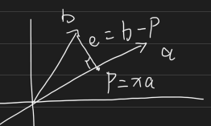

<!-- more -->

## 正交

正交一词的来源  
两条直线的夹角，又称交角  
正交，意为交角为90度

### 正交向量

Orthogonal vectors

两个列向量$a$$b$正交
有：$a^Tb = 0$  
$|a|^2 + |b|^2 = |a+b|^2$   

$a^Ta + b^Tb = (a+b)^T(a+b)$  

$a^Ta + b^Tb = a^Ta + b^Tb + a^Tb + b^Ta(后面两项，正交为0)$

* 零向量与任意向量正交

### 正交子空间

有两个空间$a, b$正交，则$a$中任意向量，与$b$的所有向量都正交  

有矩阵$A$
1. $N(A) \bot C(A^T)$
2. $N(A^T) \bot C(A)$
3. $dim(N(A)) + dim(C(A^T)) = Full\;Rank\;of\;A$  
   例$R^3$空间中二维平面子空间的正交空间是一维直线

## 投影

Projection

如图所示，有向量$a$，向量$b$，期望解出$ax=b$是无解的，于是可以做出投影$e$，有：

$a^Te = 0$正交  
$a^T(b - p) = 0$  
$a^T(b - ax) = 0$  
$a^Tax = a^Tb$  
$x = (a^Ta)^{-1}a^Tb$   
$p = ax =  a(a^Ta)^{-1}a^Tb$  
得出投影矩阵  
$M_p = a(a^Ta)^{-1}a^T$   
且投影矩阵有如下性质  
$M_p^T = M_p$  
$M_p^2 = M_p$

注意：上述推导做的事情是： 

$A^Te = 0 \longleftrightarrow A^TAx = A^Tb$  

当$Ax=b$无解时，若期望找到最优解（最近解）即可使用
$A^TAx = A^Tb$  

## 最小二乘
Least Squares

又称线性回归分析 Linear Regression

假设有点$b_1(1,1)$ $b_2(2,2)$ $b_3(3,2)$  
期望找到一条直线过三点，直线方程$C+Dx=y$  
即满足方程组:  
$C + D = 1$ ($b_1$)  
$C + 2D = 2$ ($b_2$)  
$C + 3D = 2$ ($b_3$)  

根据方程组列出$Ax = b$  
$$\begin{bmatrix}1&1\\1&2\\1&3\end{bmatrix}\begin{bmatrix}C\\D\end{bmatrix} = \begin{bmatrix}1\\2\\2\end{bmatrix} 无解$$   

$Ax = b 无解$
改求与三点误差最小的直线，即：    
$Ax-b = e$ 求最小的 $|e|$ 即：  
$|Ax - b|^2=|e|^2 = e_1^2 + e_2^2 + e_3^2$ 总误差最小 

### 微积分法
求$e_1^2 + e_2^2 + e_3^2 = (C+D - 1)^2 + (C+2D - 2)^2 + (C+3D - 2)^2$  

先求偏导  
1. 对$C$求偏导：  
    1. $(C+D - 1)^2 \rightarrow 2C + 2D - 2$  
    2. $(C+2D - 2)^2 \rightarrow 2C + 4D - 4$  
    3. $(C+3D - 2)^2 \rightarrow 2C + 6D - 4$  
    4. 求导结果为：$6C + 12D -10$
2. 对$D$求偏导：
   1. $(C+D - 1)^2 \rightarrow 2D + 2C-2$  
   2. $(C+2D - 2)^2 \rightarrow 8D + 4C-8$  
   3. $(C+3D - 2)^2 \rightarrow 18D + 6C-12$
   4. 求导结果为：$28D + 12C - 22$
3. 列出方程组求最值：
   1. $3C + 6D = 5$
   2. $6C + 14D = 11$
   3. 结果为：$C = \frac{2}{3}, D = \frac{1}{2}$ 
4. 答：$y =\frac{2}{3} + \frac{1}{2}x$ 即为最近线

* 注：其实我只完成单变量微积分的可能，其实并不会多变量微积分，还是请教了女朋友才得知解法的。

### 矩阵法

根据上面推到的投影矩阵，可知满足$A^Te = 0$的解即为最近解，即：
$A^TAx = A^Tb$  
$$\begin{bmatrix}1&1&1\\1&2&3\end{bmatrix}\begin{bmatrix}1&1\\1&2\\1&3\end{bmatrix}\begin{bmatrix}C\\D\end{bmatrix} = \begin{bmatrix}1&1&1\\1&2&3\end{bmatrix}\begin{bmatrix}1\\2\\2\end{bmatrix}$$   

$$\begin{bmatrix}3&6\\6&14\end{bmatrix}\begin{bmatrix}C\\D\end{bmatrix} = \begin{bmatrix}5\\11\end{bmatrix}$$ 
即：  
$3C + 6D = 5$  
$6C + 14D = 11$  
解：$C = \frac{2}{3}, D = \frac{1}{2}$

